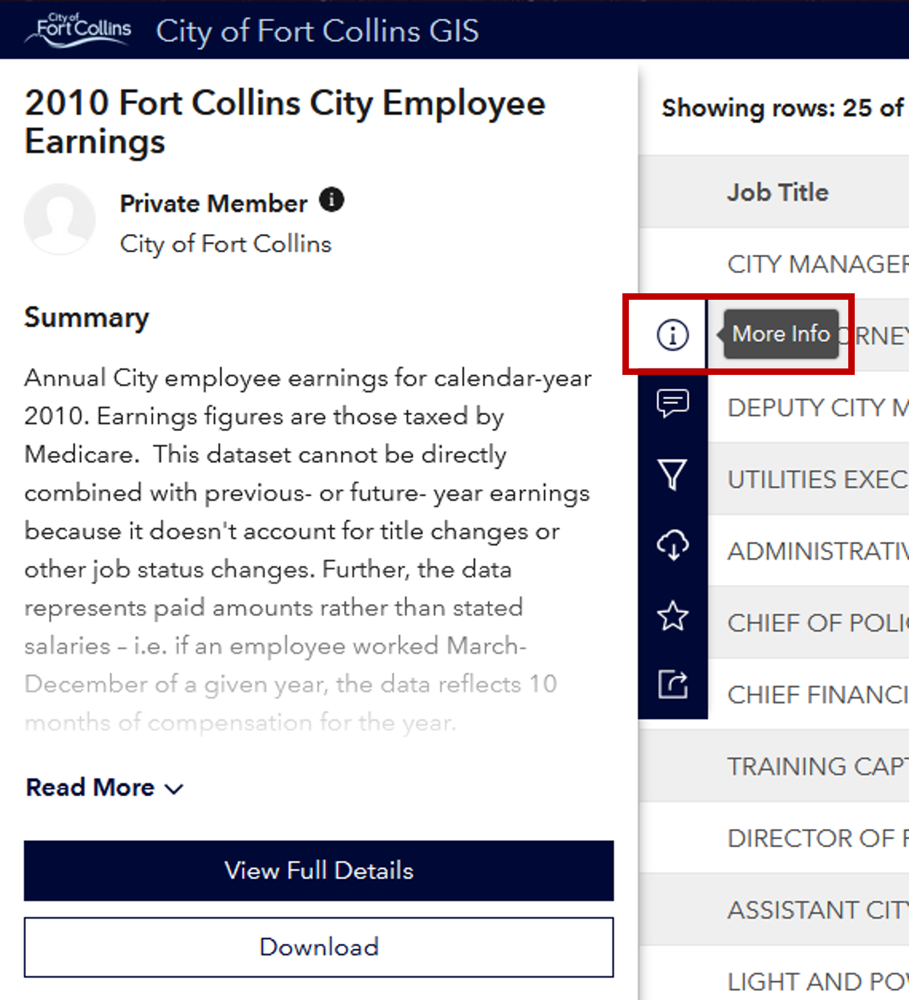
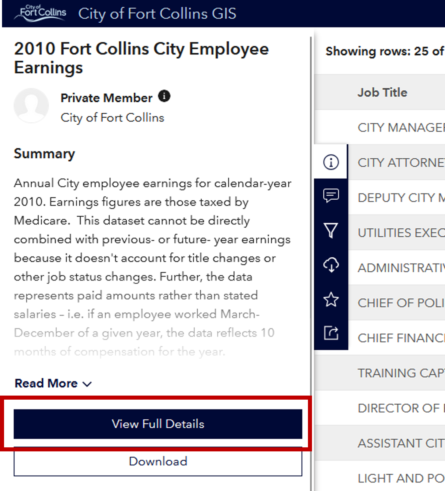
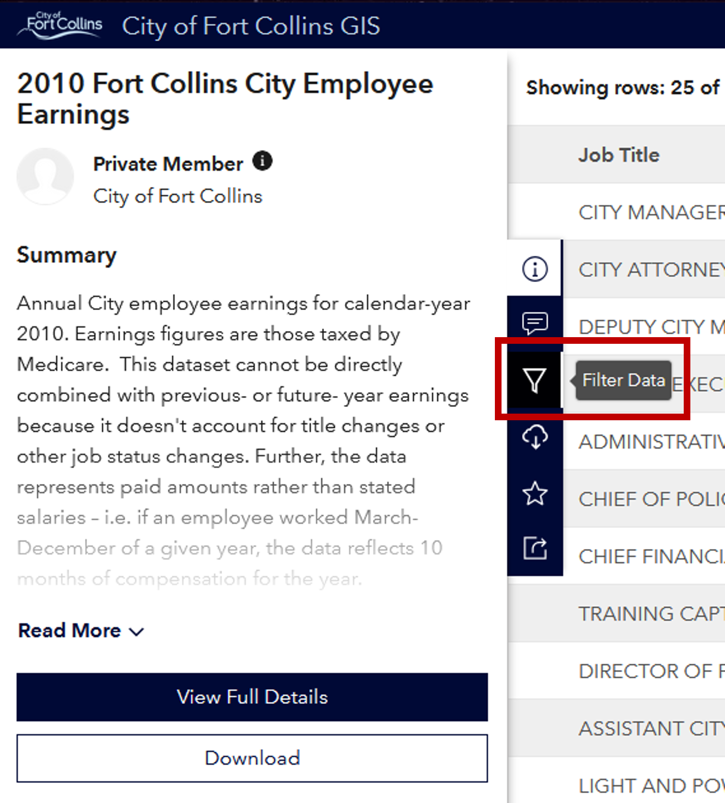
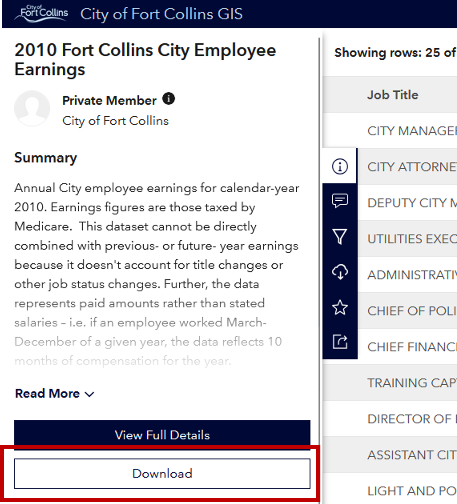
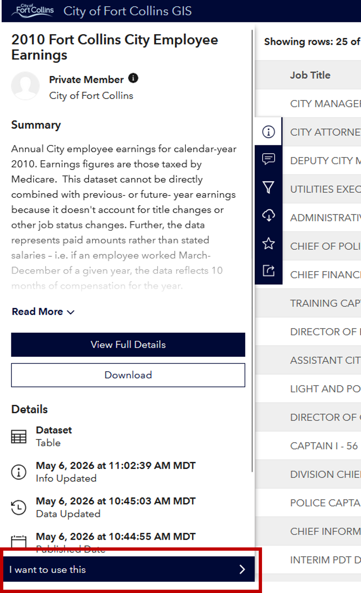
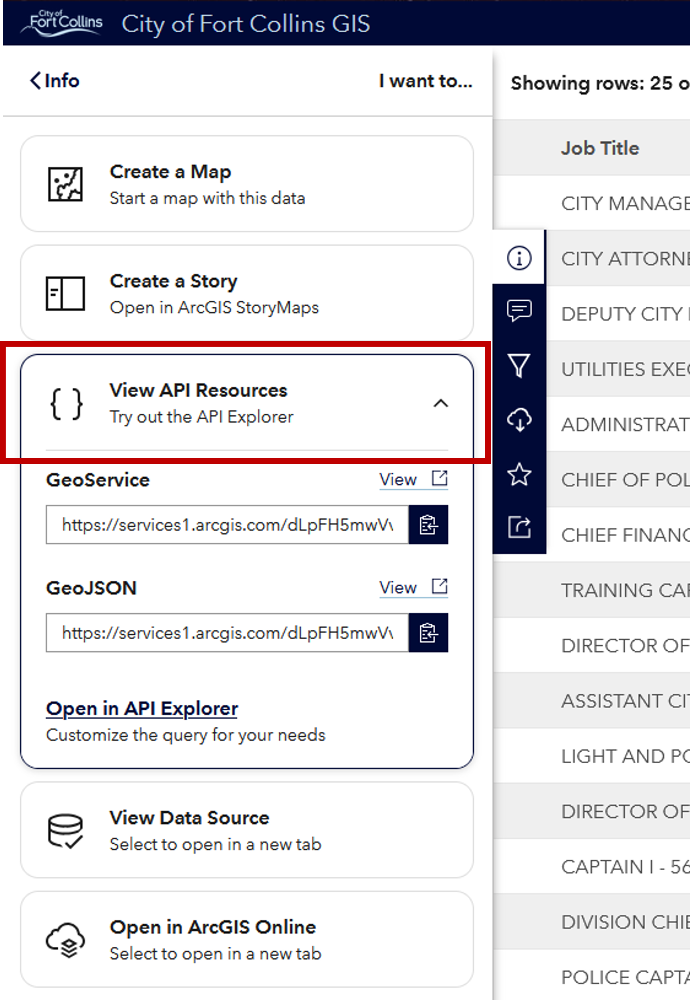

# opendata-gis-migration
Advice on City of Fort Collins Open Data web view and API migration, from https://opendata.fcgov.com to https://city-of-fort-collins-gis-fcgov.hub.arcgis.com.

# Table of Contents
1. [opendata-gis-migration](#opendata-gis-migration)
1. [Overview](#overview)
1. [Terminology](#terminology)
    1. [Deprecated portal](#deprecated-portal)
    1. [GIS portal](#gis-portal)
1. [Web view](#web-view)
1. [API access](#api-access)
    1. [Determining the resource link](#determining-the-resource-link)
    1. [API documentation](#api-documentation)
    1. [API reference](#api-reference)
        1. [Pagination](#pagination)

# Overview
On June 30, 2026, the Open Data portal at https://opendata.fcgov.com (referred to as the [deprecated portal](#deprecated-portal)) will be shutting down. Datasets will be moved to the City's GIS Open Data portal: https://city-of-fort-collins-gis-fcgov.hub.arcgis.com/pages/open-data (referred to as the [GIS portal](#gis-portal)).

The [GIS portal](#gis-portal) has hosted many of the geospatial datasets found on the [deprecated portal](#deprecated-portal); the change here is that the GIS portal will now host the tabular (non-geospatial) data as well. By combining all data into the GIS portal and discontinuing the deprecated portal, the City of Fort Collins is able to save taxpayer money while continuing to provide this raw data to the community for free.

# Terminology
## Deprecated portal
This is the Open Data portal at https://opendata.fcgov.com that will be shutting down on June 30, 2026.

## GIS portal
This is the Open Data portal that currently exists with geospatial data, but will be taking over the tabular datasets found in the deprecated portal before it shuts down.

# Web view
The [GIS portal](#gis-portal) has similar functionality to the [deprecated portal](#deprecated-portal) for web viewing:

- Deprecated portal
    - Browse datasets at https://opendata.fcgov.com/browse?sortBy=relevance&pageSize=20&limitTo=datasets
    - Select a dataset to view the metadata
    - View the data by selecting 'Data' in the upper-left corner or 'Actions' > 'Query Data' in the upper-right corner
        - 'Query Data' will open a pane at the bottom to input filters
    - Download the data as CSV, XLSX, or XML by selecting the 'Export' button in the upper-right corner
    - Get the API endpoint to the dataset by selecting 'Actions' > 'API' from the metadata page

- GIS portal
    - Browse datasets at https://city-of-fort-collins-gis-fcgov.hub.arcgis.com/search?groupIds=1eaff92e2579414e8d6cfcc123347f69&sort=Title|title|asc
    - Select a dataset to view the metadata in the left pane and the data in the right pane
        - If the metadata pane isn't visible, the 'info' icon will open it

            

        - The 'View Full Details' button in the metadata pane will redirect to a metadata page, similar to the deprecated portal

            

        - The 'filter' icon in the toolbar attached to the left pane will update the left pane to update the data filters

            

    - Download the data as CSV, Shapefile, GeoJSON, KML, and 'Data source' by selecting the 'Download' button in the metadata pane (accessible via the 'info' icon on the toolbar attached to the left pane)

        

    - Get the API endpoint to the dataset by selecting 'I want to use this' at the bottom of the metadata pane, then expand 'View API Resources'

        

        

# API access
API access functionality is also similar between the two platforms. Each have their platform-specific API structure; the deprecated portal use their 'SODA' API, while the GIS portal uses ESRI's API. This section will focus entirely on access to a dataset on the GIS portal via ESRI's API.

## Determining the resource link
From the metadata pane, select the 'I want to use this' button, then expand 'View API Resources'.

This will then show three options:

- GeoService
    - The generated URL, when called with `GET`, will return all fields and all records (with [page-limit caveats, below](#pagination))
    - The 'view' link on the right above the URL will open a Query Builder for the dataset
- GeoJSON
    - The generated URL is the same as GeoService, but returning as GeoJSON. This format won't be covered here
    - The 'view' link on the right above the URL will call the query from the URL (using `GET`)
- Open the API Explorer
    - This opens a different query builder that seems to be less helpful than the GeoService query builder for these non-geospatial datasets (although this page does include the default spatial reference used by the City of Fort Collins GIS, which could be useful for any georeference fields among the tabular data)

## API documentation
Documentation on ESRI's REST API, used for tabular data, is available at https://developers.arcgis.com/rest/services-reference/enterprise/query-feature-service-layer (available [request parameters](https://developers.arcgis.com/rest/services-reference/enterprise/query-feature-service/#request-parameters) are found below the version updates).

Documentation on querying the 'map service' data is available at https://developers.arcgis.com/rest/services-reference/enterprise/query-map-service-dynamic-layer. This is included here because of some overlap in the API parameters, specifically regarding [pagination](#pagination).

## API reference
This section gives tips for API usage of these datasets. For advanced queries, use the GeoService Query Builder (see [determining the resource link](#determining-the-resource-link)).

Dataset data can be gathered by calling `GET` against the specified query URI.

The dataset's query URI is the URL from either of the 'View API Resources' links minus the parameters, as in:

    dataset_query_uri = https://services1.arcgis.com/dLpFH5mwVvxSN4OE/ArcGIS/rest/services/<dataset_name>/FeatureServer/0/query

The only required field for queries is the `WHERE` clause. Proper formatting of the `WHERE` clause is [detailed here](https://developers.arcgis.com/rest/services-reference/enterprise/query-feature-service/#sql-92-where-clause).

    {dataset_query_uri}?where=

    # To gather all data, spoof `WHERE true` with a simple equation:
    {dataset_query_uri}?where=1=1

The default format is HTML; to return JSON use:

    {dataset_query_uri}?f=pjson

The `meta_row_index` field (available on all tabular datasets in this portal) is a good starting place for ordering the dataset:

    # Order the records by ascending meta_row_index
    {dataset_query_uri}?orderByFields=meta_row_index

> To order by descending values in a field, precede the field name with a negative sign (`-`) (e.g. `?orderByFields=-meta_row_index`)

Using all of the above, a simple query can be structured as:

    GET {dataset_query_uri}
        # Gather all records
        ?where=1=1
        # Sort them by ascending meta_row_index
        &orderByFields=meta_row_index
        # Return as JSON
        &f=pjson

### Pagination
This service limits API results to 1000 items per call; to retrieve additional results, pagination must be used.

`resultOffset` and `resultRecordCount` are used to paginate, by offsetting the initial result and limiting the number of records per call (respectively). For example, the following will start returning records at the 2,000th record and include only 100 records (records 2,000 through 2,100):

    GET {dataset_query_uri}
        ?where=1=1
        &orderByFields=meta_row_index
        # Offset the results
        &resultOffset=2000
        # Return a specified number of records
        &resultRecordCount=100
        &f=pjson

> It's advisable to always include a non-empty `orderByFields` clause in all queries when dealing with pagination

The response key `exceededTransferLimit` dictates whether additional call(s) are necessary to retrieve the full dataset. When the response includes `"exceededTransferLimit": true`, this indicates additional results are available and an additional call needs to be made after incrementing `resultOffset` (or adding it to the query).

If either `resultOffset` or `resultRecordCount` is used in the API call, the `exceededTransferLimit` key will always be included in the response (detailed at https://developers.arcgis.com/rest/services-reference/enterprise/query-map-service-dynamic-layer/#new-at-1031), so the full query results have been returned when `"exceededTransferLimit": false` is in the response.

If neither `resultOffset` and `resultRecordCount` are included in the query, `exceededTransferLimit` is an optional key in the response; in this case, a missing key is equivalent to `"exceededTransferLimit": false`.
